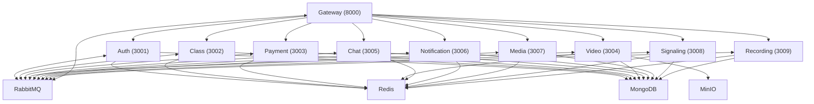

# ClassCast


---

## 🎓 Overview

**ClassCast** is a production-grade live teaching platform where educators can host paid live lectures and pre-recorded courses. Students can discover content, pay via Stripe, join live sessions with WebRTC (powered by Mediasoup SFU), and receive certificates upon completion.

### ✨ Features

| Feature                        | Description                                                      |
|--------------------------------|------------------------------------------------------------------|
| 🧑‍🏫 Paid Live Lectures        | Host and join interactive live classes                            |
| 🎥 Pre-recorded Courses        | Upload and access on-demand video content                         |
| 💳 Stripe Payments             | Secure payments with 80/10/10 split (educator/platform/partner)   |
| 🔒 JWT & OAuth Auth            | Secure authentication and session management                      |
| 💬 Real-time Chat              | WebSocket chat with Redis pub/sub                                 |
| 📺 HLS Streaming & Recording   | Adaptive streaming and live session recording                     |
| 📜 Certificates                | Auto-generate certificates on course completion                   |
| 📧 Email Notifications         | Automated emails for events and reminders                         |
| 📊 Monitoring                  | Prometheus & Grafana dashboards                                   |
| 🐳 Dockerized                  | Easy deployment with Docker, Compose, and Kubernetes              |

---

## 🏗️ Architecture



---

## 🛠️ Tech Stack

| Layer         | Technology                                      |
|-------------- |-------------------------------------------------|
| Backend       | Node.js, Express.js                             |
| Database      | MongoDB, Redis                                  |
| Messaging     | RabbitMQ, Redis Pub/Sub                         |
| Media         | FFmpeg, HLS, Mediasoup (WebRTC SFU), MinIO      |
| Payments      | Stripe Connect                                  |
| Realtime      | WebSocket, Socket.io                            |
| DevOps        | Docker, Docker Compose, Kubernetes, GitHub Actions |
| Monitoring    | Prometheus, Grafana                             |

---

## ⚡ Prerequisites

```bash
# Node.js >= 18.x
# Docker & Docker Compose
# MongoDB, Redis, RabbitMQ, MinIO (can be run via Docker Compose)

# Install Node.js dependencies
npm install

# Install Docker & Docker Compose (macOS)
brew install --cask docker
```

---

## 🚀 Quick Start

```bash
# 1. Clone the repository
 git clone https://github.com/your-org/classcast-backend.git
 cd classcast-backend

# 2. Copy and edit environment variables
 cp .env.example .env

# 3. Start all services (dev)
 docker-compose up --build

# 4. Access Gateway
 http://localhost:8000
```

---

## 📚 API Endpoints

| Service         | Port  | Base Path           | Description                  |
|-----------------|-------|---------------------|------------------------------|
| Auth            | 3001  | /auth               | JWT, OAuth, sessions         |
| Class           | 3002  | /class              | Courses, lectures, enroll    |
| Payment         | 3003  | /payment            | Stripe, split payments       |
| Video           | 3004  | /video              | Upload, HLS, transcoding     |
| Chat            | 3005  | /chat               | WebSocket chat               |
| Notification    | 3006  | /notification       | Emails, certificates         |
| Media           | 3007  | /media              | WebRTC SFU                   |
| Signaling       | 3008  | /signaling          | WebSocket signaling          |
| Recording       | 3009  | /recording          | Live recording               |
| Gateway         | 8000  | /                   | API gateway                  |

---

## 🔑 Environment Variables

See `.env.example` for all variables. Key variables include:

```env
# MongoDB
MONGO_URI=mongodb://localhost:27017/classcast

# Redis
REDIS_URL=redis://localhost:6379

# RabbitMQ
RABBITMQ_URL=amqp://localhost

# MinIO
MINIO_ENDPOINT=localhost
MINIO_PORT=9000
MINIO_ACCESS_KEY=your-access-key
MINIO_SECRET_KEY=your-secret-key

# Stripe
STRIPE_SECRET_KEY=sk_test_...
STRIPE_WEBHOOK_SECRET=whsec_...

# JWT
JWT_SECRET=your_jwt_secret
```

---

## 🗂️ Project Structure

```
classcast-backend/
├── docker-compose.yml
├── Dockerfile
├── package.json
├── src/
│   ├── gateway/
│   ├── services/
│   │   ├── auth/
│   │   ├── class/
│   │   ├── payment/
│   │   ├── video/
│   │   ├── chat/
│   │   ├── notification/
│   │   ├── media/
│   │   ├── signaling/
│   │   └── recording/
│   └── shared/
└── ...
```

---

## ☁️ Deployment

### Docker Compose
```bash
docker-compose -f docker-compose.prod.yml up --build -d
```

### Kubernetes (example)
```bash
kubectl apply -f k8s/
```

### GitHub Actions
- CI/CD pipeline included in `.github/workflows/`

---

## 🤝 Contributing

1. Fork the repository
2. Create your feature branch (`git checkout -b feature/your-feature`)
3. Commit your changes (`git commit -am 'Add new feature'`)
4. Push to the branch (`git push origin feature/your-feature`)
5. Create a new Pull Request

---

## 📄 License

This project is licensed under the MIT License. See the [LICENSE](LICENSE) file for details.
